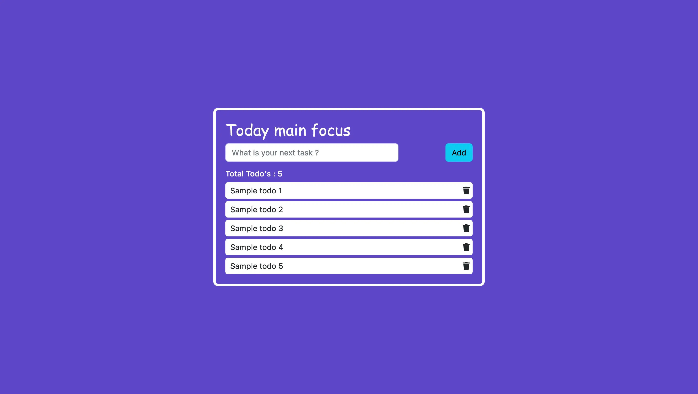

# react-todo

This is a simple ToDo application built with React. It allows users to create tasks and mark them as complete when done. Users can also delete tasks by clicking on them.

<hr>

💙 Join the channel to see more videos like this. [Code_With_Pankaj](https://www.youtube.com/c/CodeWithPankaj1?sub_confirmation=1)
<hr>

<div align=center>

## Must visit 👇 (Click on it)

[](https://www.youtube.com/c/CodeWithPankaj1?sub_confirmation=1)

</div>

<hr>

## Features

- A responsive design.
- Effect of hovering.
- Click on item to delete.

# Usage
To create a new task, type the task name in the input field and press the Enter key. The new task will appear in the task list.

To mark a task as complete, click on the checkbox next to the task name.

To delete a task, click on the task name.

## Authors

- [@pankajbaliyan](https://www.github.com/pankajbaliyan)


## Contributing

This project is open for contributions. If you would like to contribute to this project, you can fork the repository and submit a pull request.<br>
Contributions are always welcome!

See `index.html` for ways to get started.

Please adhere to this project's `code of conduct`.


## Demo

<!-- add link -->
<br><br>
<!-- add link -->


## Feedback

If you have any feedback, please reach out to us at pankajbaliyan90@gmail.com


## 🔗 Links

[](https://codewithpankaj.vercel.app)

<a href="https://www.youtube.com/c/codewithpankaj1?sub_confirmation=1" target="blank"></a>
<a href="https://linkedin.com/in/pankaj-kumar-90" target="blank"></a><br><br>
<a href="https://leetcode.com/pankajkumar90/" target="blank"></a>
<a href="https://auth.geeksforgeeks.org/user/im_pankaj/practice/" target="blank"></a><br><br>
<a href="https://twitter.com/_pankaj_kumar__" target="blank"></a>
<a href="https://www.hackerrank.com/pankajbaliyan90" target="blank"></a>
<a href="https://discord.gg/qYz4cYc9zP" target="blank"></a>


## Lessons Learned

- <b>React Hooks:</b> React hooks allow you to use state and other React features in functional components, instead of using class components. In this ToDo application, you can use the useState hook to manage the state of the tasks.

- <b>State Management with useState:</b> The useState hook is a function that returns an array of two elements: the current state value and a function to update it. You can use useState to manage the state of the tasks in the ToDo application.

- <b>Props:</b> In React, props are used to pass data from a parent component to a child component. In this ToDo application, you can pass the tasks as props to the TaskList component.

- <b>Component Composition:</b> Component composition is the process of building complex UIs by combining smaller, reusable components. In this ToDo application, you can use component composition to create the Task and TaskList components.

- <b>Conditional Rendering:</b> In React, you can conditionally render components based on the state of the application. In this ToDo application, you can conditionally render the completed tasks based on the showCompleted state.

- <b>Event Handling:</b> In React, you can handle events such as click, submit, and change using event handlers. In this ToDo application, you can handle the click event to delete tasks.

- <b>CSS Styling:</b> You can use CSS to style your React components. In this ToDo application, you can use CSS to style the UI components such as the input field, task list, and buttons.## Run Locally

## Get local copy of project

1. Clone the repository to your local machine:

```bash
  git clone https://github.com/PankajBaliyan/react-todo.git
```

2. Install the required packages:

```bash
  cd react-todo
  npm install
```

3. Start code editor

```bash
  code .
```

4. Start the application:
```bash
  npm start
```

5. Open your browser and go to http://localhost:3000 to view the application.


## Screenshots




## Support

For support, email pankajbaliyan90@gmail.com or join our Slack channel.